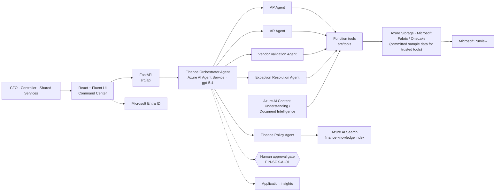

# Finance Operations Agent Accelerator

A demo-ready **Finance Operations Command Center** that shows how **Azure AI Foundry** automates
Accounts Payable, Accounts Receivable and Finance Knowledge Management with a multi-agent
architecture, document understanding, grounded retrieval and human-in-the-loop approvals.

Built for CFOs, finance transformation leaders, controllers, shared services leaders and finance
operations teams — and for the Microsoft and partner teams who demonstrate to them.

> **Foundry required.** Runtime reasoning and agent orchestration use Azure AI Foundry. The
> committed dataset supports trusted tool execution, while the included Bicep templates provision
> the required Azure architecture.

---

## What it demonstrates

| Scenario | Capabilities |
| --- | --- |
| **AP Agent** | Invoice ingestion and extraction, vendor validation, three-way PO matching, duplicate detection, approval routing, exception summaries, simulated ERP posting |
| **AR Agent** | Remittance ingestion, payment-to-invoice matching, unapplied cash, payment discrepancies, collections prioritisation, AR health summaries |
| **Finance Knowledge Agent** | Cited answers over AP, AR, treasury, SOX and finance operations documentation using RAG |

## Architecture at a glance



Detailed diagrams — solution architecture, agent orchestration, AP and AR sequences, data flows and
the security model — are in [`docs/architecture`](docs/architecture/architecture.md).

## Quickstart (Foundry runtime, ~2 minutes)

```bash
# Dashboard and API
pip install -r requirements.txt
pip install -r requirements-azure.txt
uvicorn src.api.main:app --reload --port 8000
```

Set `FINANCE_AGENT_MODE=foundry` and `AZURE_AI_PROJECT_ENDPOINT` in `.env` before starting the
API. The service fails fast when Foundry is not configured; it does not use a local reasoning
fallback.

Open the dashboard at [http://localhost:8000/](http://localhost:8000/) or the API documentation at
[http://localhost:8000/docs](http://localhost:8000/docs). The bundled dashboard is a standalone
HTML page served directly by FastAPI, so it does not require Node, npm, or Vite.

Ask the Finance Copilot, or call the API directly:

```bash
curl -s -X POST http://localhost:8000/api/chat \
  -H "Content-Type: application/json" \
  -d '{"message":"Why is invoice INV-1047 blocked?","session_id":"demo"}'
```

Regenerate the synthetic dataset at any time (it is deterministic, so the demo script always holds):

```bash
python -m src.data.generate_sample_data --output sample-data
```

## The seven demo moments

| # | Ask | Shows |
| --- | --- | --- |
| 1 | *Show invoices awaiting approval over $10,000* | Value-ranked approval queue |
| 2 | *Why is invoice INV-1047 blocked?* | PO variance plus a five-figure duplicate caught pre-payment |
| 3 | *Approve all invoices under $2,000 with no exceptions* | Straight-through processing behind a human confirmation gate |
| 4 | *What cash remains unapplied?* | Working capital trapped in suspense, with root causes |
| 5 | *Show the largest payment matching exceptions* | Cash application exceptions ranked by impact |
| 6 | *What approvals are required for invoices over $25,000?* | Policy citation combined with live exposure |
| 7 | *What SOX control governs invoice approvals?* | Audit-ready, cited answer (FIN-SOX-AP-01) |

Full talk track: [`docs/demo-guide/demo-script.md`](docs/demo-guide/demo-script.md).

## Repository structure

```
docs/
  architecture/        Solution architecture, data flows, security & governance (Mermaid)
  demo-guide/          End-to-end demo script and talk track
  api-specification.md REST API contract
  deployment.md        Azure deployment and Foundry runtime instructions
src/
  agents/              Orchestrator + AP, AR, policy, vendor and exception agents; Foundry adapter
  tools/               19 function tools shared by the API and the Foundry agents
  prompts/             Agent instructions and prompt templates
  api/                 FastAPI application and schemas
  data/                Data store and the deterministic sample-data generator
infra/
  bicep/               Storage, AI Search, Foundry, Document Intelligence, Key Vault,
                       Log Analytics / App Insights, Container Apps, RBAC
  foundry/             Declarative Foundry project, connections and agent definitions
  search/              finance-knowledge index, skillset, indexer and data source
sample-data/
  invoices/            50 invoices, 40 purchase orders, 12 vendors, document facsimiles
  remittances/         25 remittances, 40 AR invoices, 8 customers, document facsimiles
  knowledge/           AP, AR and treasury policies, SOX controls guide, operations handbook
ui/static-demo.html    Standalone dashboard served directly by FastAPI
ui/webapp/             Optional React + TypeScript + Fluent UI source dashboard
tests/                 Pytest suite for the tools, dataset, orchestrator and API
```

## Controls and governance

The accelerator is opinionated about how agents are allowed to behave in a finance function:

- **Human in the loop (FIN-SOX-AI-01)** — agents recommend and prepare; approving, posting, writing
  off and master data changes require an authenticated human decision, recorded with identity and
  timestamp.
- **Traceability (FIN-SOX-AI-02)** — every agent action is logged (agent, tool, inputs, outcome) and
  surfaced in the Agent Activity Feed and Application Insights.
- **Grounding (FIN-SOX-AI-03)** — policy answers cite their source document and section; an
  unsupported question is refused rather than answered from general knowledge.
- **Identity over secrets** — Azure access uses Microsoft Entra ID managed identity and RBAC; no
  keys or connection secrets are stored in code.

See [`docs/architecture/security-and-governance.md`](docs/architecture/security-and-governance.md).

## Deploying to Azure

```bash
az group create --name rg-finops-agent --location eastus2
az deployment group create --resource-group rg-finops-agent \
  --template-file infra/bicep/main.bicep --parameters infra/bicep/main.parameters.json
```

Then create the AI Search index, upload the sample data, and provision the agents:

```bash
FINANCE_AGENT_MODE=foundry AZURE_AI_PROJECT_ENDPOINT=<project-endpoint> \
  python -m src.agents.foundry_client
```

Step-by-step instructions, environment variables and cleanup:
[`docs/deployment.md`](docs/deployment.md).

## Tests

```bash
pip install -r requirements-dev.txt
python -m pytest
```

The suite covers the AP and AR tools, retrieval grounding, dataset invariants that the demo script
depends on, the orchestrator's routing and confirmation gate, and the REST API contract consumed by
the dashboard.

## Disclaimer

All vendors, customers, invoices, payments and policy documents in this repository are **synthetic**
and generated for demonstration purposes. Approval thresholds, controls and service levels are
illustrative: align them with your own delegation of authority and control framework before use.
