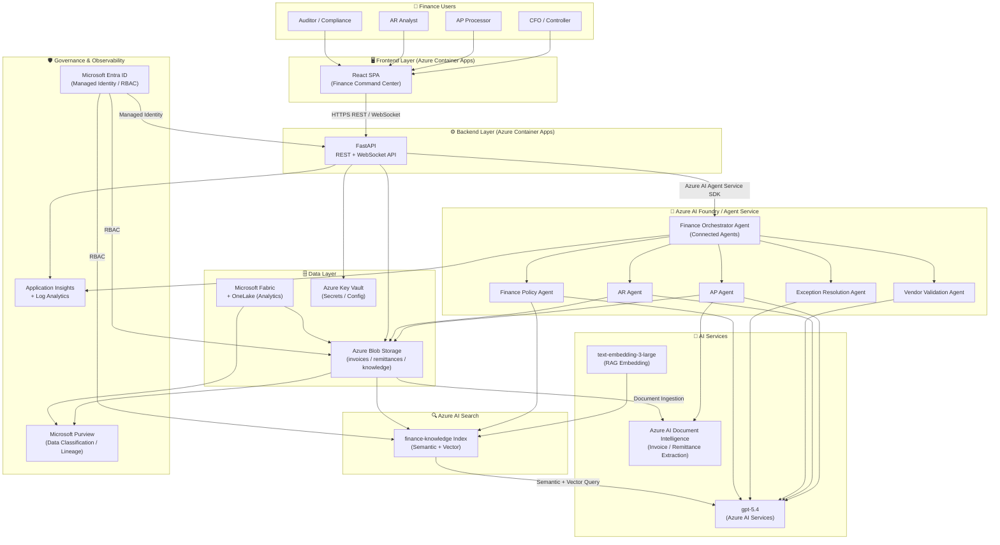
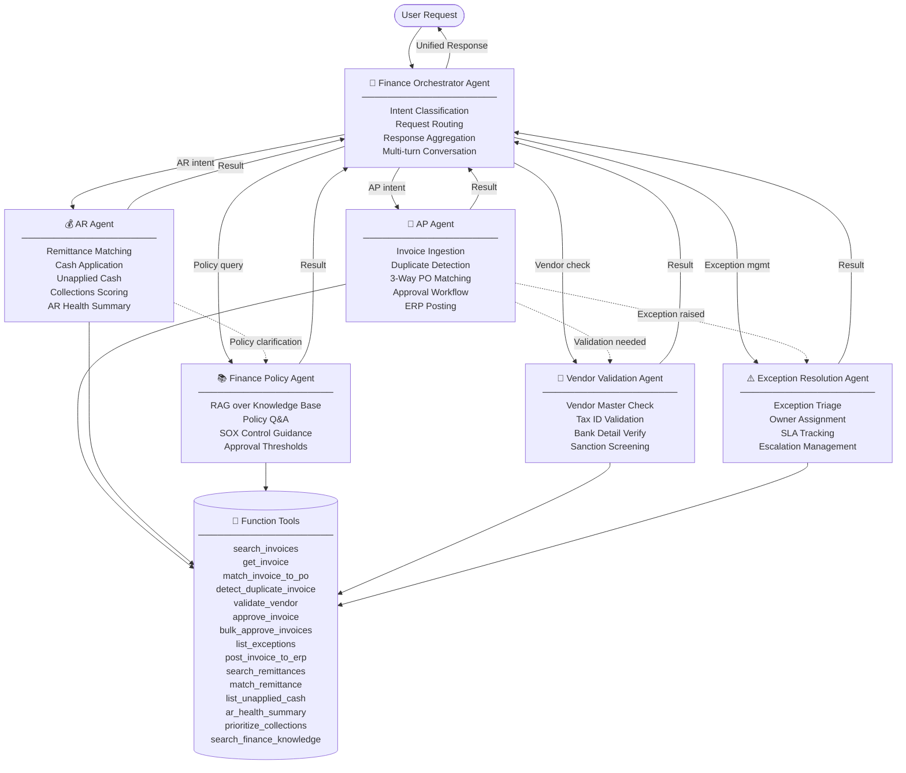
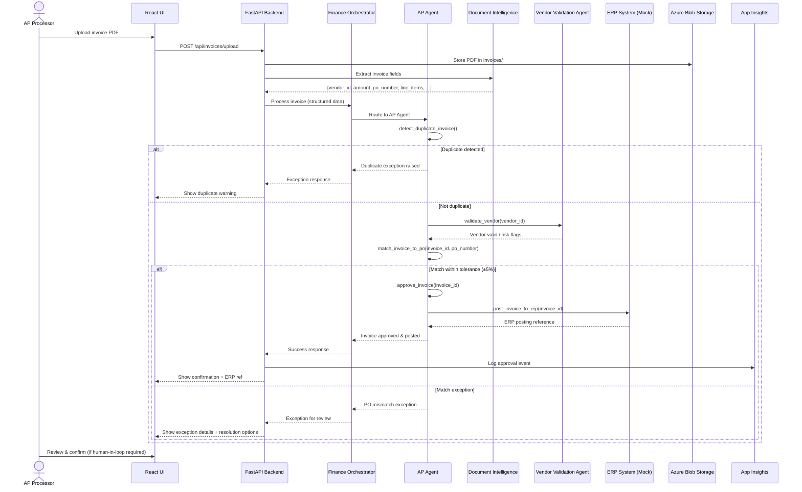
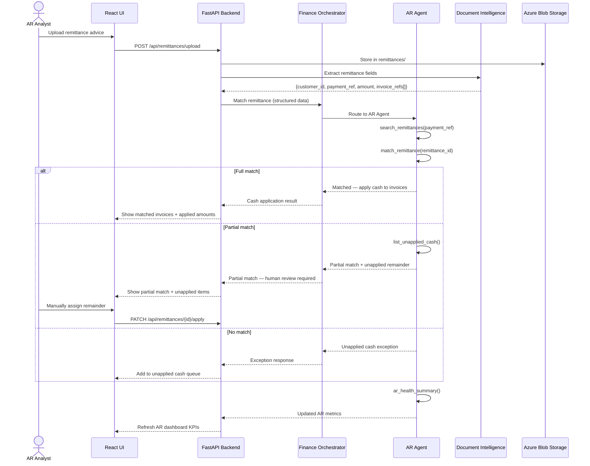

# Finance Operations Agent Accelerator — Solution Architecture

## Overview

The Finance Operations Agent Accelerator is a **multi-agent AI system** built on Azure AI Foundry that automates and augments Accounts Payable (AP), Accounts Receivable (AR), and Finance Knowledge Management for enterprise finance teams. It targets CFOs, controllers, and shared-services leaders who need to reduce manual processing time, improve working capital visibility, and maintain SOX-compliant controls.

---

## Diagram A — End-to-End Solution Architecture

---

## Diagram B — Multi-Agent Orchestration Graph

---

## Diagram C — AP Invoice Processing Sequence

---

## Diagram D — AR Cash Application Sequence

---

## Component Responsibility Table

| Component | Technology | Primary Responsibility |
|-----------|-----------|------------------------|
| React SPA | React 18 + TypeScript (Azure Container Apps) | Finance Command Center UI — AP/AR dashboards, agent chat, approvals |
| FastAPI Backend | Python 3.12 + FastAPI (Azure Container Apps) | REST API, agent orchestration, tool function implementations, auth middleware |
| Finance Orchestrator | Azure AI Agent Service (gpt-5.4) | Intent classification, child-agent routing, multi-turn conversation state |
| AP Agent | Azure AI Agent Service (gpt-5.4) | Invoice processing, 3-way matching, approvals, ERP posting |
| AR Agent | Azure AI Agent Service (gpt-5.4) | Remittance matching, cash application, collections, AR analytics |
| Finance Policy Agent | Azure AI Agent Service (gpt-5.4) | RAG-powered policy Q&A, SOX/GAAP guidance |
| Vendor Validation Agent | Azure AI Agent Service (gpt-5.4) | Vendor master validation, sanction screening |
| Exception Resolution Agent | Azure AI Agent Service (gpt-5.4) | Exception triage, assignment, SLA tracking, escalation |
| Azure AI Search | Standard SKU + Semantic Ranker | Vector + semantic search over finance knowledge base |
| Azure AI Document Intelligence | FormRecognizer (S0) | Invoice and remittance field extraction |
| Azure Blob Storage | StorageV2 (LRS) | Document storage: invoices, remittances, knowledge |
| Microsoft Fabric + OneLake | Fabric Lakehouse | Finance analytics, historical reporting, reconciliation |
| Microsoft Purview | Data catalog | Data classification, lineage, compliance scanning |
| Application Insights | Workspace-based | Agent telemetry, latency tracing, error alerting |
| Key Vault | Standard SKU | Secrets management (ERP credentials, API keys) |
| Microsoft Entra ID | Managed Identity + RBAC | Zero-credential identity for all service-to-service calls |

---

## Key Design Decisions

| Decision | Choice | Rationale |
|----------|--------|-----------|
| Agent framework | Azure AI Agent Service (connected agents) | Native Foundry integration; built-in tool execution, tracing, and state management |
| Model | gpt-5.4 | Latest Azure OpenAI reasoning model; strong structured-output and function-calling performance |
| Auth strategy | System-assigned managed identity + RBAC | No secrets or connection strings in code; auditable; automatic rotation |
| Document extraction | Azure AI Document Intelligence | Pre-built invoice model handles varied layouts without custom training |
| RAG embedding model | text-embedding-3-large (3072 dims) | Best-in-class semantic accuracy for financial terminology |
| Deployment target | Azure Container Apps | Serverless scale-to-zero; handles variable demo and production workloads |
| Offline mode | `FINANCE_AGENT_MODE=local` | Enables fully offline demo against JSON sample data with no Azure dependency |
| Human-in-loop | Approval step in AP/AR workflow | Maintains SOX control requirement for human authorization above threshold |
