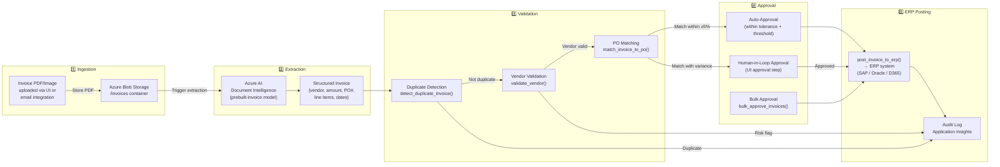

# Finance Operations Agent Accelerator — Data Flow

## Overview

This document describes how data moves through the system from ingestion to ERP posting (AP) and cash application (AR), as well as the RAG indexing pipeline for the Finance Knowledge Base.

---

## 1. AP Invoice Processing Data Flow



### AP Data Flow — Stage Details

| Stage | Input | Process | Output | Error Path |
|-------|-------|---------|--------|-----------|
| Ingestion | PDF, TIFF, PNG invoice | Upload to blob, trigger indexer | Blob URI | Storage error → retry queue |
| Extraction | Blob URI | Document Intelligence prebuilt-invoice | Structured JSON (vendor, amount, PO#, line items) | Low-confidence → exception queue |
| Duplicate Detection | Invoice hash (vendor + amount + date) | DB lookup + fuzzy match | Pass / Duplicate flag | Duplicate → exception |
| Vendor Validation | vendor_id | Master data check + sanction list | Valid / Risk flag | Invalid → exception |
| PO Matching | invoice_id + po_number | 3-way match: PO qty × unit price ≤ invoice ± 5% | Matched / Variance | Variance > threshold → human review |
| Auto-Approval | Matched invoice ≤ approval threshold | Approve without human action | Approved status | > threshold → human review |
| Human Approval | Invoice exceeds threshold or has variance | UI approval action | Approved / Rejected | Rejected → exception |
| ERP Posting | Approved invoice | Call ERP API with structured payload | ERP reference number | ERP failure → retry + exception |

---

## 2. AR Remittance and Cash Application Data Flow

```mermaid
flowchart LR
    subgraph Ingest2["1️⃣ Ingestion"]
        RemDoc["Remittance Advice\n(PDF, email, EDI)"]
        BlobRem["Azure Blob Storage\n/remittances container"]
    end

    subgraph Extract2["2️⃣ Extraction"]
        DI2["Azure AI\nDocument Intelligence"]
        RemStruct["Structured Remittance\n{customer, payment_ref,\namount, invoice_refs[]}"]
    end

    subgraph Match2["3️⃣ Matching"]
        RemMatch["Remittance Match\nmatch_remittance()"]
        FullMatch["Full Match\n(all invoices resolved)"]
        PartMatch["Partial Match\n(some invoices unresolved)"]
        NoMatch["No Match\n(unapplied cash)"]
    end

    subgraph Apply["4️⃣ Cash Application"]
        AutoApply["Auto Cash Application\n(full match)"]
        HumanApply["Human-Assisted Application\n(partial/no match)"]
        UnappliedQ["Unapplied Cash Queue\nlist_unapplied_cash()"]
    end

    subgraph Analytics["5️⃣ AR Analytics"]
        Health["AR Health Summary\nar_health_summary()\n{DSO, aging, overdue %}"]
        Collections["Collections Prioritization\nprioritize_collections()\n{risk-scored customer list}"]
    end

    RemDoc -->|Store| BlobRem
    BlobRem --> DI2
    DI2 --> RemStruct
    RemStruct --> RemMatch
    RemMatch --> FullMatch
    RemMatch --> PartMatch
    RemMatch --> NoMatch
    FullMatch --> AutoApply
    PartMatch --> HumanApply
    NoMatch --> UnappliedQ
    HumanApply --> AutoApply
    AutoApply --> Health
    Health --> Collections
```



---

## 3. Finance Knowledge RAG Indexing Pipeline

```mermaid
flowchart TB
    subgraph Source["📂 Source Documents"]
        Docs["Finance Policy PDFs\nSOX Controls\nAccounting Procedures\nApproval Matrices"]
        BlobK["Azure Blob Storage\n/knowledge container"]
    end

    subgraph Indexing["🔄 Azure AI Search Skillset"]
        Extract3["Document Extraction Skill\n(PDF → text + metadata)"]
        Split["Text Split Skill\n(2000 chars, 200 overlap)"]
        Embed["Azure OpenAI Embedding Skill\ntext-embedding-3-large\n(3072 dims)"]
        IndexProj["Index Projection\n(parent-child chunks)"]
    end

    subgraph Index["🔍 Azure AI Search Index"]
        VectorIdx["Vector Field\ncontent_vector\n(HNSW cosine)"]
        TextIdx["BM25 Text Fields\ntitle, content, section"]
        SemanticIdx["Semantic Ranker\nfinance-semantic-config"]
    end

    subgraph Query["🤖 RAG Query (at inference time)"]
        UserQ["User Policy Question"]
        QueryEmbed["Query Embedding\n(text-embedding-3-large)"]
        Hybrid["Hybrid Search\n(BM25 + vector + semantic)"]
        Rerank["Semantic Re-ranking\n+ Caption Extraction"]
        Context["Context Chunks\n→ gpt-5.4 prompt"]
        Answer["Grounded Answer\n+ Source Citations"]
    end

    Docs --> BlobK
    BlobK -->|Scheduled indexer (2h)| Extract3
    Extract3 --> Split
    Split --> Embed
    Embed --> IndexProj
    IndexProj --> VectorIdx
    IndexProj --> TextIdx
    IndexProj --> SemanticIdx

    UserQ --> QueryEmbed
    QueryEmbed --> Hybrid
    VectorIdx --> Hybrid
    TextIdx --> Hybrid
    Hybrid --> Rerank
    SemanticIdx --> Rerank
    Rerank --> Context
    Context --> Answer
```

### RAG Pipeline — Configuration Summary

| Parameter | Value | Rationale |
|-----------|-------|-----------|
| Chunk size | 2,000 characters | Balances context richness with token economy |
| Chunk overlap | 200 characters | Preserves sentence continuity across boundaries |
| Embedding model | text-embedding-3-large (3072d) | Highest accuracy for financial terminology |
| Vector algorithm | HNSW (m=4, efSearch=500) | Sub-millisecond ANN search at standard scale |
| Query type | Hybrid (BM25 + vector) | Handles both keyword (account codes) and semantic queries |
| Semantic ranker | finance-semantic-config | Re-ranks top-50 results; extracts captions for LLM context |
| Top-K | 5 chunks per query | Fits within context window; reduces hallucination risk |

---

## 4. End-to-End Data Lineage Summary

```
Finance Documents (Blob) → Document Intelligence → Structured Data (API layer)
                                                         ↓
                                            Agent Tool Functions (Python)
                                                         ↓
                                    gpt-5.4 (Azure AI Foundry Agent Service)
                                                         ↓
                                        Finance User (React UI / API response)

Knowledge Documents (Blob) → AI Search Skillset → HNSW + Semantic Index
                                                         ↓
                                            Finance Policy Agent (RAG)
                                                         ↓
                                    gpt-5.4 grounded response with citations
                                                         ↓
                                        Finance User (React UI / API response)

All data operations → Application Insights (telemetry + traces)
All data assets     → Microsoft Purview (classification + lineage)
All identities      → Microsoft Entra ID (managed identity + RBAC)
```
